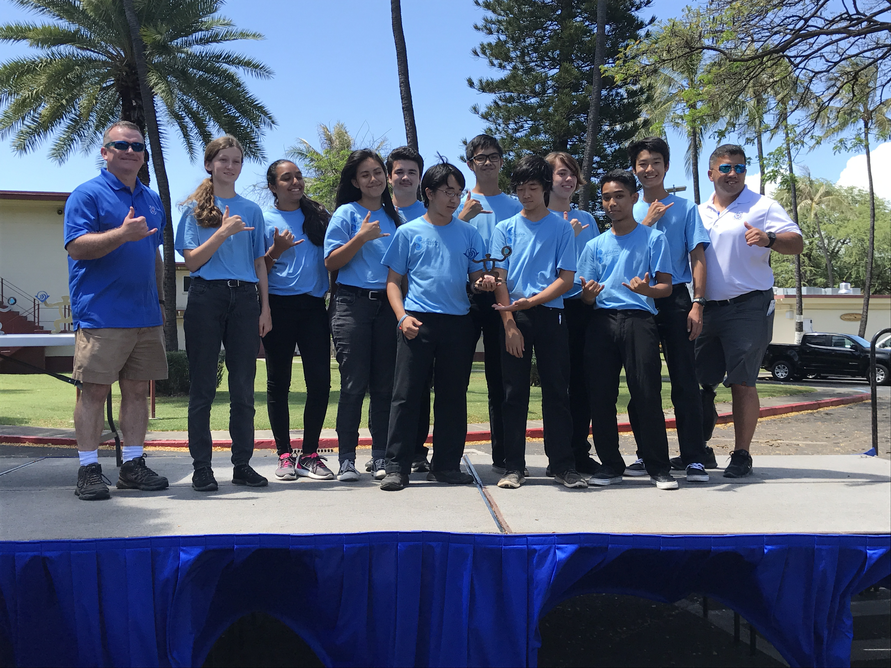

The Kailua High School Robotics Program originally started as an afterschool club that was formed by me and my friends during our junior and senior year of high school.  The goal of the program is to build an underwater robot capable of competing in the MATE ROV competition.  During my time on the team, we received numerous awards including 4th and 5th place at the 2012 and 2013 International MATE ROV Competition.

I am currently a mentor for the program, and teach students the basic concepts of building an underwater robot and building a business.  Students learn and apply many of the skills they would learn in STEM courses, but also develop technical skills such as technical writing and public speaking.  They are challenged every day to find solutions to new problems and situations.

This year, my students created their very own underwater remotely operated vehicle and called it, the Carbon Bat or C-BAT.  My students developed the idea of creating an ROV that was adaptable to any situation.  They accomplished this by creating a carbon fiber rod frame, where components can be easily added, removed, or modified through the use of rubber clamps, velcro straps, and aluminum bars.  They were to use the C-BAT to complete missions that simulate the tasks given in a request for proposal, given by the Port City of Long Beach.

Throughout the year, I taught my students the process of designing and building their very own ROV.  I also taught them business skills such as marketing, technical writing, and public speaking in order to label themselves as a company.  They competed at the 2017 Oahu Regional at US Coast Guard Base Honolulu, on May 09, 2017 and placed 3rd overall.  
